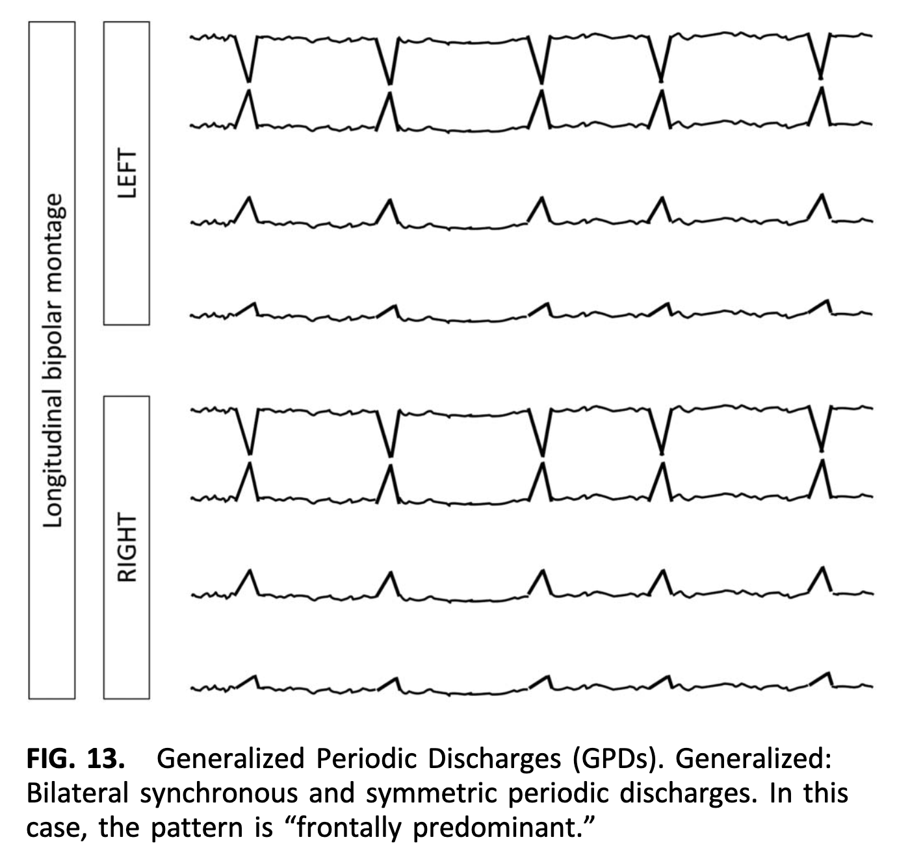
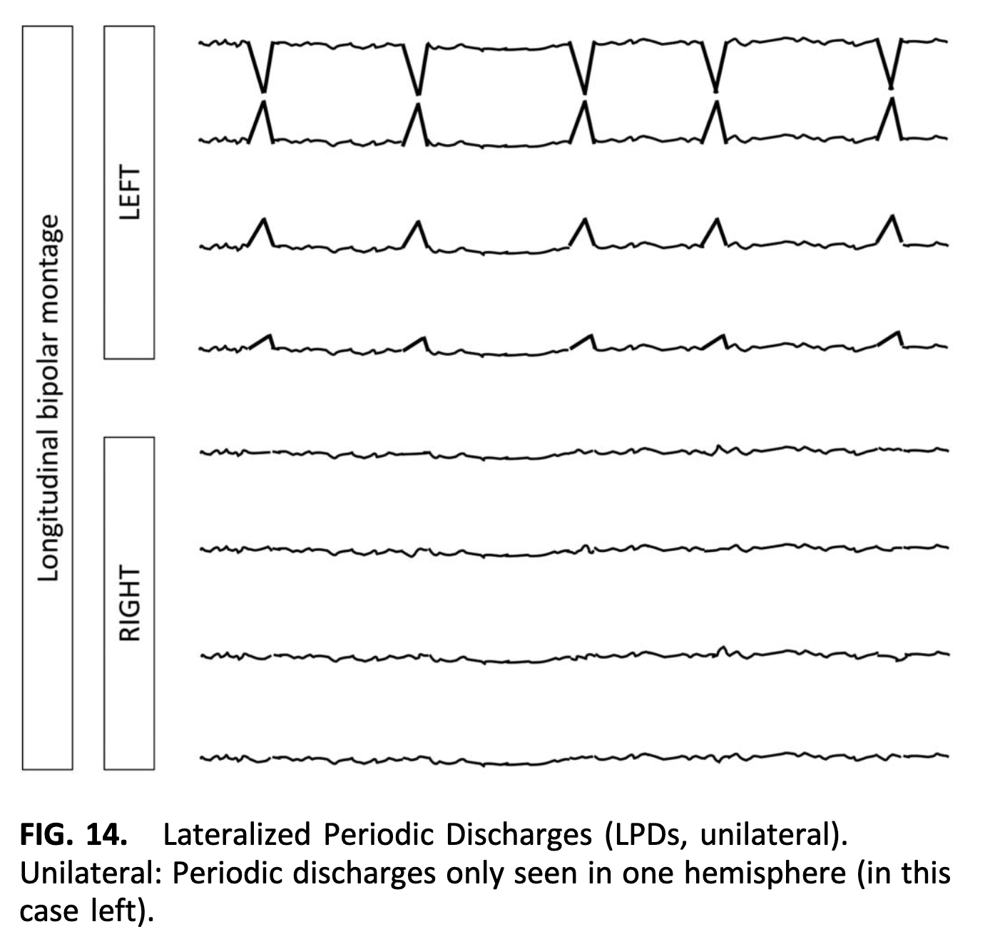
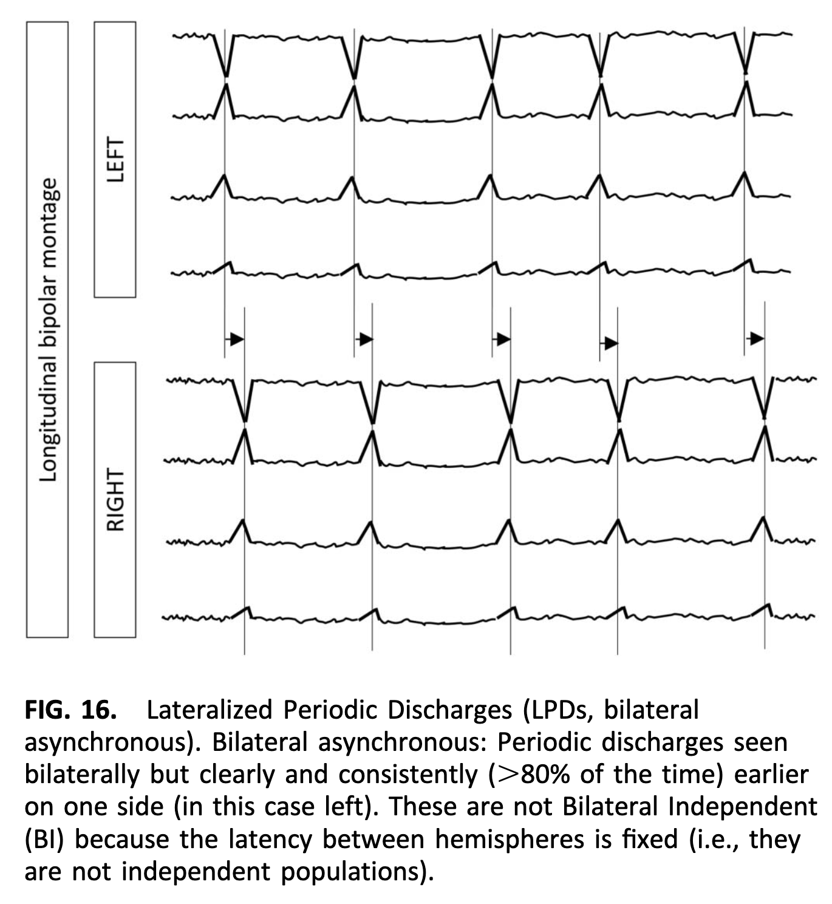
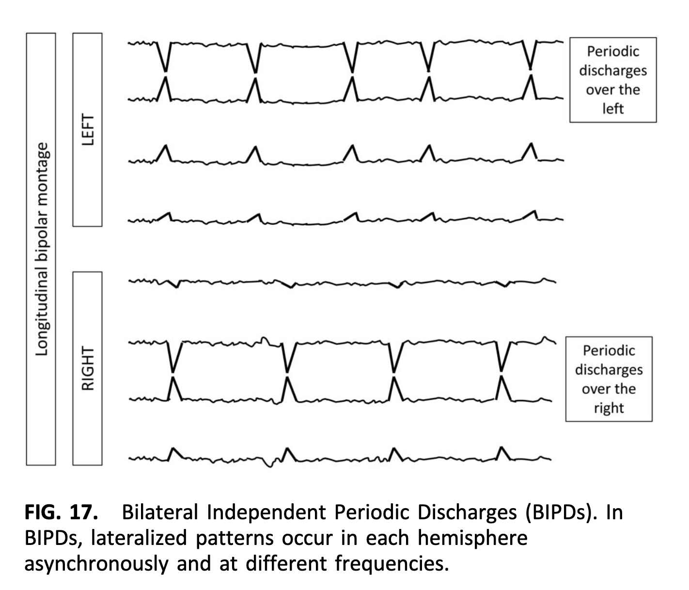
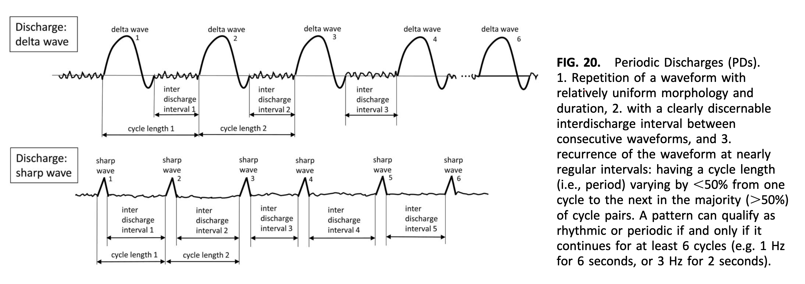
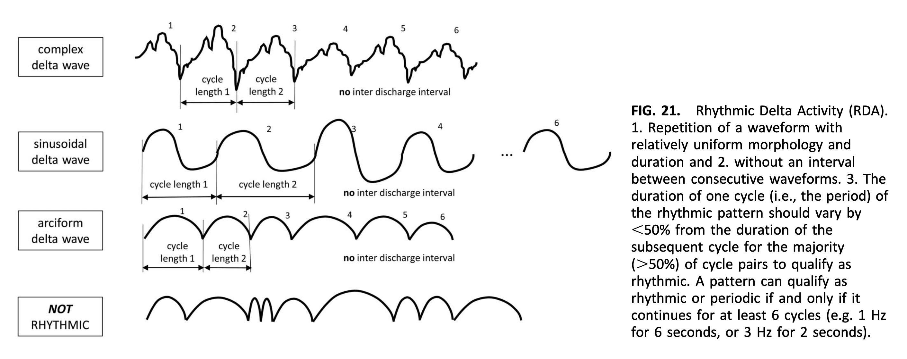
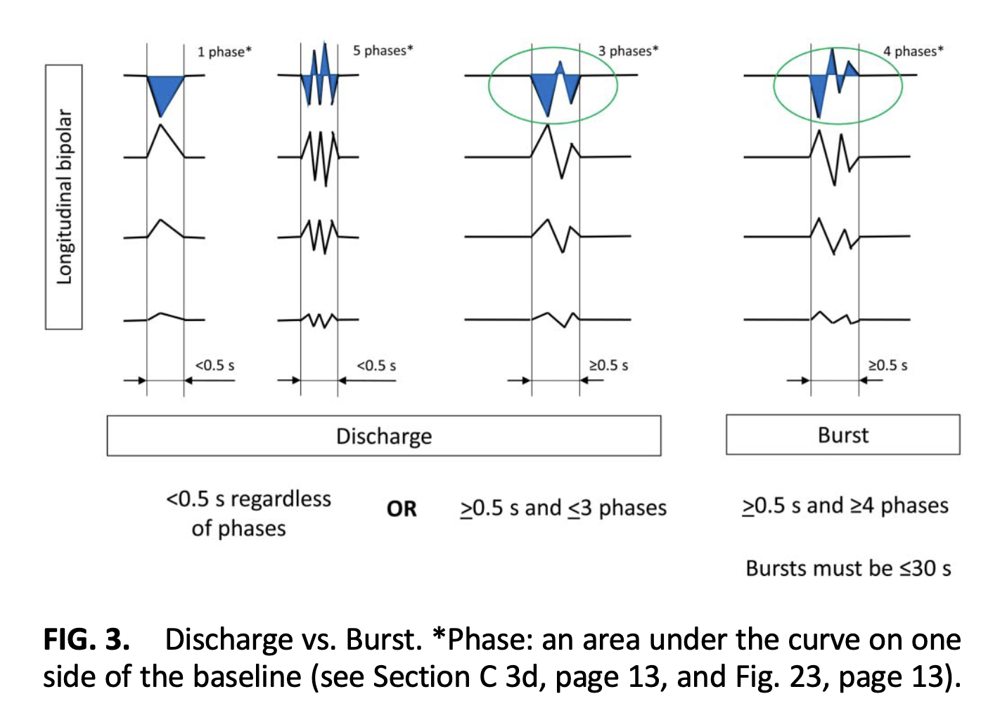

# 専門用語についてのメモ

## EEGデータの電極の配置と電位の測定方向について

10-20 system[2]に従っている。

### LL (Left Lateral)

左側の側頭部に沿う線を前頭から後頭にかけて横切る方向に、隣接する2点の電位差を計測している。電位差の測定方向は後頭側がグランドになっている。

- Fp1-F7
- F7-T3
- T3-T5
- T5-O1

### RL (Right Lateral)

LLの右側バージョン。

- Fp2-F8
- F8-T4
- T4-T6
- T6-O2

### LP (Left Parasagittal)

左側のparasagittal line(体の中央線に並行する線)に沿った方向に、前頭から後頭にかけての隣接する2点の電位差を計測している。

- Fp1-F3
- F3-C3
- C3-P3
- P3-O1

### RP (Right Parasagittal)

LPの右側バージョン。

- Fp2-F4
- F4-C4
- C4-P4
- P4-O2

### Fz/Cz/Pz

midline(体の左右の対称面に沿う線)上を前頭から後頭にかけて、隣接する2点の電位差を計測している。

- Fz-Cz
- Cz-Pz

### EKG

心電図のデータらしい。医師が診断するときこのデータも参考にしているのだろうか？

> The EKG column is for an electrocardiogram lead that records data from the heart.

### A1-A2

両耳の電極はコンペデータでは欠落している。

## ラベルについて

[1]に詳細な説明がある。

- seizure: てんかん発作。
- LPD: Lateralized Periodic Discharge
- GPD: Generalized Periodic Discharge
- LRDA: Lateralized Rhythmic Delta Activity
- GRDA: Generalized Rhythmic Delta Activity
- other: 上記以外

### Generalized v.s. Lateralized

- Generalized: 左右両方の脳に同じパターンがほぼ同じ電圧で現れる(Fig. 13)
- Lateralized: 片方の半球のみ or 左右非対称なパターン(Fig. 14)

#### Generalizedパターンの詳細な区分

- Frontally predominant
  - anterior(前頭側)の電圧がposterior(後頭側)の電圧よりも平均値で50%以上大きい
- Occipitally predominant
  - posterior(後頭側)の電圧がanterior(前頭側)の電圧よりも平均値で50%以上大きい
- Midline predominant
  - midline(体の左右の対称面に沿う線)の電圧がparasagittal(体の左右の対称面付近の線)の電圧よりも平均値で50%以上大きい
- Generalized
  - 全ての領域で同様の電圧で、上記のいずれの区分にも当てはまらない

#### Lateralizedパターンの詳細な区分

- Unilateral
  - 左右片方の半球にのみ現れる。
- Bilateral asymmetric
  - bilateral(両方の半球に現れる)だが片方の半球の振幅が明らかに大きい。
- Bilateral asynchronous (Fig. 16)
  - bilateralだが片方の脳の信号が一方の脳の信号と時間がずれて同期している。
- Bilateral Independent (Fig. 17)
  - 2種類の異なるlateralizedパターンが左右両方の脳に同時にそれぞれ現れる。

### PD v.s. RDA

- Periodic Discharge (Fig. 20)
  - ほぼ同じ形状の波形がほぼ一定のintervalを置いて周期的に現れる。
  - 最低でも6サイクル現れる必要がある
- Rhythmic Delta Activity (Fig. 21)
  - ほぼ同じ形状の波形がintervalなしに周期的に現れる。

## ラベル以外の専門用語について

- burst/discharge
- phase
- polarity

### Discharge v.s. Burst

- discharge:
  - 短い期間(<0.5s)に任意のphaseからなる
  - やや長い期間(>0.5s)でphase<=3
- Burst:
  - やや長い期間(0.5s < t <= 30s)でphase>=4

## Reference

- [1] American Clinical Neurophysiology Society’s Standardized Critical Care EEG Terminology: 2021 Version
- [2] <https://en.wikipedia.org/wiki/10%E2%80%9320_system_(EEG)>
