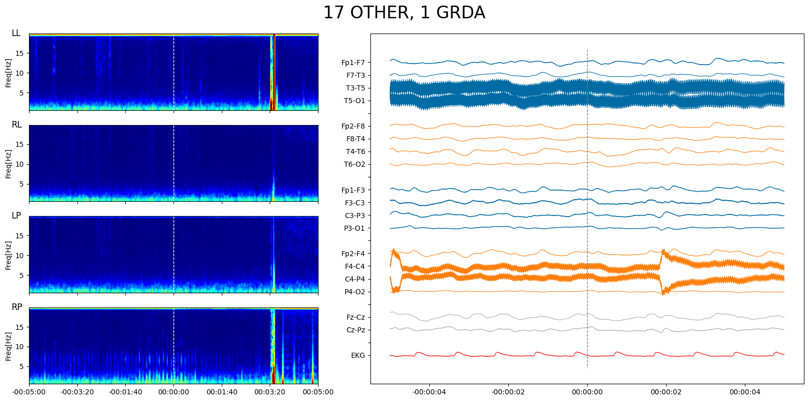
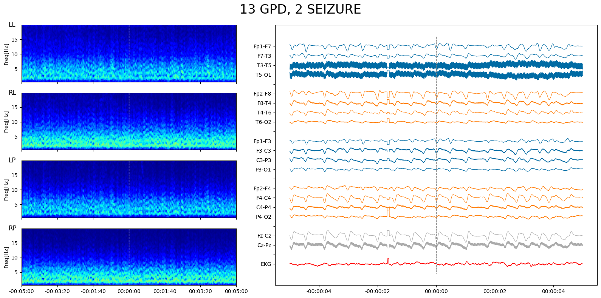
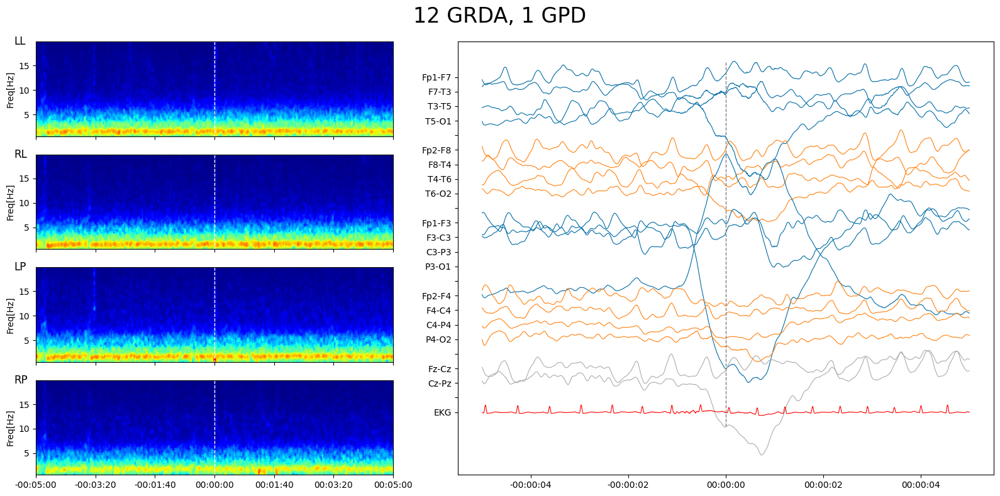

# EEG信号の前処理について

## Bad-channelの扱いについて

電極にはさまざまなノイズ源が考えうるが、ここではchannel自体が悪い場合の信号の扱いについて検討する。

## bad-channelの定義

例えば、10-20system中の19電極のうち、1つが外れてしまったり、接続不良を起こしてしまったようなケースが想定されうる。目視で確認した限りではtrainingデータセットにこの種のデータ不良が頻繁に確認できる。例えば、以下の3つの図では特定の電極を起点とした電位差の信号が正負対称に現れているのが見て取れ、その電極の信号がノイズ源となっていることが推察できる。

## bad-channelに関する既存研究

ここではチャネル$c$ における信号を$x_c(t)$ とした時に、$x_c$ を系列長の次元をもつベクトルとして考える。
チャネル$c \in \mathcal{C}$ の信号からbad-channelを選び出すタスクは、anomaly detectionタスクとみなせる。

ナイーブにはMedianやIQRなどの統計量を元にしたheuristicな手法がある[1]。
この方法は信号の集約された統計量の特徴にのみ基づくもので、信号の時間的な変化の特徴は捨象してしまっている。
もう一段階進んだ方法では、信号の時系列を次元$T$ のベクトルとみなし、さまざまな距離尺度(Euclid, Gaussian etc.)を使って異なるチャネル同士の系列の類似度(similarity)を表現し、類似度がある閾値(threshold)を上回るかどうかによってanomalyを検出する手法がある。
[2]は後者の手法の一つで、1) L2距離および 2) 系列の標準偏差により正規化した系列のL2距離尺度を用いて、これらの距離空間におけるlocal cluster近傍におけるサンプルの密度を相対的に評価する方法を提案した。

具体的にはLocal Outlier Factor(LOF)という以下の指標によりoutlierの度合いを評価する。

$$
\text{LOF}_k(p) = \frac{\sum_{o \in N_k(p)}\text{LRD}_k(o) / \text{LRD}_k(p)}{\vert N_k(p) \vert}
$$

$$
\text{LRD}_k(p) = \left( \frac{\sum_{o \in N_k(p)} d_k(p, o)}{\vert N_k(p) \vert } \right)^{-1}
$$

$$
d_k(p, o) = \max\{ d_{L_2}(p, o), d_{\text{std}L_2}(p, o) \}
$$

$$
d_{L_2} = \sqrt{\sum_{i=1}^n (q_i - p_i)^2 }
$$

$$
d_{\text{std}L_2} = \sqrt{\sum_{i=1}^n \left( \frac{q_i - p_i}{\sigma_i} \right)^2 }
$$

LRD(Local Reachability Density)は、対象とするnode $p$に対して、周囲のtop-kとの距離の和の平均の逆数によって定義され、直感的には*node p周辺のクラスタの密度*に対応する。また、LOFはnode pにおけるLRDを、*周辺のk近傍の点のLRDと相対的な大きさを比較した指標*として定義される。node pにおけるLRDが周囲と比べて大きい場合、*周囲よりも疎な領域に位置するサンプルであることを現るので*outlierとして評価される。逆に、pにおけるLRDが周囲と同じくらいの場合、*node pは比較的密集した領域にある*ことを示すため、正常なサンプルとして評価される。
なお、論文ではハイパーパラメータ$N_k$ は$N_k=3$ で固定し、outlierかどうかを決定する閾値はcross validationにより決定している。

## さまざまなノイズ源とartifactについて

EEG信号には脳をソースとするもの以外にも以下のようなartifact(対象とする信号以外の人工的な信号)やノイズが混入している。

1. ocular: 目の動き（瞬きなど）をソースとする
1. myogenic: 体の筋肉の動きをソースとする
1. cardiac: 心臓の動きをソースとする
1. electricity noise: 周辺機器の交流電源をソースとする(50Hz or 60Hz, USは50Hzらしい)

4は特定の周波数の信号を取り除くnotch filterによって除外するのが一般的である。
また、古典的には、関心のある周波数帯の信号のみをband-pass filterによって抽出する前処理がよく行われる。

**図. 電源をソースとするノイズ**[5]; 50Hzのところに鋭いピークが現れている。

## Reference

- [1] Bad channel detection in EEG recordings
- [2] Adaptable and Robust EEG Bad Channel Detection Using Local
Outlier Factor (LOF)
- [3] EEGdenoiseNet: A benchmark dataset for end-to-end
deep learning solutions of EEG denoising
- [4] Self-Supervised Learning for Anomalous Channel Detection in EEG Graphs: Application to Seizure Analysis
- [5] <http://learn.neurotechedu.com/preprocessing>
