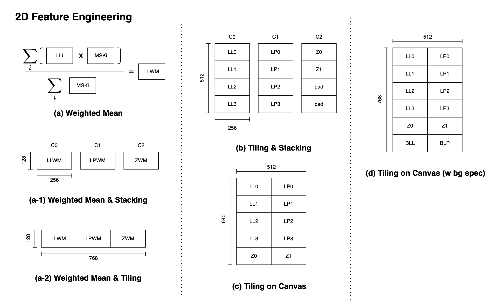
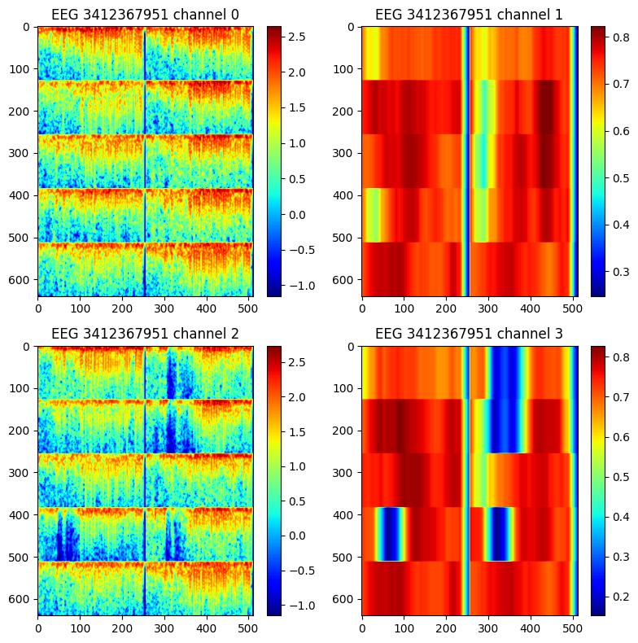

# Ablation study of 2D seizure classification models

This ablation study clarifies the effect of proposed methods with 2D seizure classification models.

## 1. Methods

### 1.1. Spec aggregation policy

I investigated effect of different spec aggregation policies.
I tested following policies.

#### a) Weighted-Mean

This policy takes 2-step processing: first it takes weighted mean of specs in the same channel groups with spec masks (CQM; later discussed), then stacking/tiling these specs.

There are two different sub-policies available:

1. **Weighted-mean stacking**: stacking in channel dimension(fig 1-a)
2. **Weighted-mean tiling**: tiling in spatial dimension(fig 1-b)

#### b) Tiling & Stacking

This policy fills in a tile with same channel groups, and stacking these tiles with different chanel groups(fig1-b).

#### c) Canvas Tiling

This policy fills all the available channels of specs in a single canvas(Fig1-c,d, Fig-2).

**Fig. 1: Picture of different spec aggregation policies**

### 1.2. 左右の対応するチャネルとの類似度の特徴の追加

左右の対応するチャネル(例: Fp1とFp2)どうしのencoderの出力のembeddingどうしのcosine類似度を計算し、d次元のベクトルにmapした上でchannel方向に結合した。

この特徴により、左右の対応するチャネルの差異の特徴が拾えるがめ、lateralityの判別に寄与することが期待できる。

### 1.3. CQM(Channel Quality Mask)の追加

CQFによる時間方向のchannel qualityを周波数方向に拡張してmask(CQM; channel quality mask)を生成し、head直前のembeddingにconcatenateした。

**Fig.2: Sample Image of CQMs**: Example pictures of specs and CQMs with CanvasTiling policy is shown. First two channels shows spec and CQM of left brain, and the last two picture shows those of right brain.

### 1.4 Swap-invalid L/R mapping

左右の対応するチャネル（e.g. Fp1 and Fp2）のembeddingをheadに入力するさい、単純にチャネル方向に結合してheadに入力すると左右のチャネルの交換に対して異なる表現を学習する必要がある。

$$
\hat{y} = [h_\text{left}, h_\text{right}]W^\top \ne [h_\text{right}, h_\text{left}]W^\top \tag{1}
$$

これに対し、左右のチャネルの交換に対して不変なマッピングを適用してからheadに入力することで交換に対してロバストな表現を学習することが期待できる。

$$
\begin{align*}
u &= f(h_\text{left}, h_\text{right})\\
v &= g(h_\text{left}, h_\text{right})\\
\end{align*} \tag{2}
$$

$$
\text{ s.t. } f(x, y) = f(y, x), g(x, y) = g(y, x) \tag{3}
$$

左右のチャネルの交換に対して不変なマッピングとしては以下のようなものが考えられる。

1. *max-min*: $u, v = \min(x, y), \max(x, y)$
1. *mean-diff*: $u, v = \frac{x+y}{2}, |x - y|$
1. *sum-prod*: $u, v = x + y, x \odot y$

予備的な検証の結果、*max-min*と*mean-diff*でCVにおいて同程度のKL divergenceの低下(-0.006)が確認できたため、このablation studyでは*max-min*を採用した。

## 2. 結果

本節では各Trialに対するablation studyの結果について議論する。

評価指標として、validation setのKL divergenceに対し、vote数の総数で重みづけ平均をとったものを用いた。

$$
\text{metric}_\text{val} := \frac{\sum_i N_i \mathcal{L}_\text{KL} (y_i, \hat{y}_i)}{\sum_i N_i}
$$

モデルの統計的なばらつきを緩和するため3 fold x 3random seedの9つのモデルの平均をとった。

### 2.1. specの結合方法について

CanvasTilingが最も効果的で、WeightedMeanStackingと比較して0.052のpositiveな寄与が見られた（表1）。

全体的に、チャネル方向に組み合わせるよりも、可能な限り1枚の画像に組み合わせる手法の方が性能への寄与が大きい。

この理由としては、channel方向の結合はearly fusionで、空間方向の結合はlate fusionに相当するためだと考えている。late fusionの方が計算コストは高いが、チャネル間の抽象的な交互作用を学習できるためであろう。

**表1. 異なるspecの結合方法におけるvalidation setにおけるKL divergenceの比較**

| exp_name | spec aggregation policy | is dual? | w sim feat? | w mask? | w lr_map | val_kl_div↓ | diff    | LB↓  | diff(LB)↓ | scoring min |
|----------|-------------------------|----------|-------------|---------|----------|-------------|---------|------|------------|-------------|
| exp043   | WeightedMeanStacking    | ✔️       | ✔️          | ✔️      |          | 0.448       | +0.052  | 0.37 | +0.06      | 11          |
| exp046   | WeightedMeanTiling      | ✔️       | ✔️          | ✔️      |          | 0.435       | +0.039  | 0.36 | +0.05      | 12          |
| exp048   | CanvasTiling            | ✔️       | ✔️          | ✔️      |          | **0.396**       | 0.000   | **0.31** | 0.00       | 14          |

### 2.2. 左右のチャネルの類似度特徴の有無

左右チャネルの類似度追加の寄与の効果については、各結合方法で一貫して0.013-0.018程度のpositiveな寄与が見られた（表2）。
予め想定した通り、左右のチャネルの類似度がLateralityの判定に寄与するためと考えている。

### 2.3. Channel quality maskの有無

Channel quality maskの寄与は微弱だが、各結合方法で一貫して0.007-0.008程度のpositiveな寄与が見られた。
Channel品質についての事前知識をモデルに供給することで微弱ながら性能に寄与していることがわかる。

positiveな寄与が見られた理由は、CQMによりspecのうち無視して良い領域についての情報（例: 図2の右側の図における青い色で示した領域）がモデルに提供されることで学習におけるノイズの影響が緩和されるためだと考えている。

CQMの寄与が微弱だった理由についてはいくつか考えられる。

1. 訓練データにおけるchannelのノイズの影響が限定的であるため
1. 2DモデルがCQFに相当するチャネル品質についての情報をspecから自力で学習できるため
1. CQFではチャネルのノイズの情報を十分に捉えきれていないため

### 2.4. Swap-invariant L/R mapping

Swap-invalid L/R mappingについては0.004-0.010程度のpositiveな寄与が確認できた。

**表2. 各結合方法におけるtrialの遮断試験の結果**

| exp_name | spec aggregation policy | is dual? | w sim feat? | w mask? | w lr_map | val_kl_div↓ | diff | LB↓  |
|----------|---------------------|----------|-------------|---------|----------|------------------|---------------|------|
| exp049   | WeightedMeanStacking| ✔️       |             | ✔️      |          | 0.466            | +0.028        |      |
| exp044   |                     | ✔️       | ✔️          |         |          | 0.456            | +0.018        |      |
| exp043   |                     | ✔️       | ✔️          | ✔️      |          | 0.448            | +0.010        | 0.37 |
| exp057   |                     | ✔️       | ✔️          | ✔️      | ✔️       | 0.438            | 0.000         |      |
| exp050   | WeightedMeanTiling  | ✔️       |             | ✔️      |          | 0.449            | +0.017        |      |
| exp045   |                     | ✔️       | ✔️          |         |          | 0.443            | +0.011        |      |
| exp046   |                     | ✔️       | ✔️          | ✔️      |          | 0.435            | +0.004        | 0.36 |
| exp059   |                     | ✔️       | ✔️          | ✔️      | ✔️       | 0.432            | 0.000         |      |
| exp051   | CanvasTiling        | ✔️       |             | ✔️      |          | 0.411            | +0.021        | 0.32 |
| exp047   |                     | ✔️       | ✔️          |         |          | 0.403            | +0.013        | 0.33 |
| exp048   |                     | ✔️       | ✔️          | ✔️      |          | 0.396            | +0.006        | **0.31** |
| exp058   |                     | ✔️       | ✔️          | ✔️      | ✔️       | **0.390**            | 0.000         | **0.31** |
