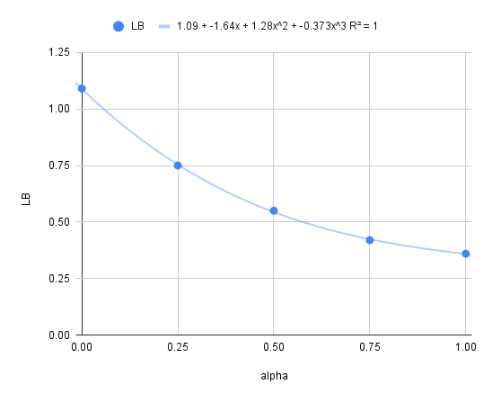

# LB Probingの結果について

## 目的

* geziのProbingに基づく「n_vote<10はノイズなので除外すべき」という仮定をどの程度信用して良いのかについて、チーム内でエビデンスに基づく仮説を立てること。

## 方法

geziの手法に則り、

1. 全データで学習したモデル(target model)に対し、testの各クラスのモデルの予測確率の平均値をLB Probing（参照点法）により推定する
1. あらかじめ計算したOOFの*high-quality*, *low-quality*の各クラスの予測確率およびLB Probingで推定された予測値をもとにtestにおける*high-quality*, *low-quality*の配合比率を推定する

## 上記手法の限界について

1. target modelの予測確率の分布は真のラベルの確率分布と乖離している可能性がある
1. LB Probingの測定誤差が一定入る（参照点法だとLBの桁数に精度が左右される）

## 用語

* *VLQ (very low quality)*: n_vote < 3 のサンプルのこと
* *LQ (low quality)*: 3 <= n_vote < 10 のサンプルのこと
* *HQ (high quality)*: 10 <= n_vote のサンプルのこと

## 結果

表1にOOF/Testのそれぞれにおける、各クラスのtarget modelの予測分布をまとめる。
ここから、以下の事実が言える

1. target modelの予測分布から推定したtestにおけるseizureラベルの存在確率(0.140)は、trainにおけるseizureの存在確率(0.105)より35%程度多い。
1. testがlow-qualityとhigh-qualityの混合であるという仮定に基づくと、seizureの存在確率から線形補完によって求めた配合比率は0.22。
1. testにおけるLPDおよびGPDの存在確率はtrainにおけるhigh-qualityのそれに近い。一方で、testにおけるGRDA/Otherの存在確率はtrainにおけるlow-qualityのそれに近い

**表1: Probingにより推定されたTestにおける各seisure typeに対するモデルの予測確率の平均値**

| class  | $p_\text{train}^\text{LQ}$ | $p_\text{train}^\text{HQ}$ | $\tilde{p}_\text{oof}^\text{LQ}$ | $\tilde{p}_\text{oof}^\text{HQ}$ | $\tilde{p}_\text{test}$ | $\tilde{\alpha}_\text{test}^\text{LQ}$ |
|--------|-------------|-------------|-----------|-----------|--------|-------------|
| sizure | 0.329       | 0.042       | 0.262     | 0.105     | 0.140  | 0.22        |
| lpd    | 0.108       | 0.182       | 0.100     | 0.163     | 0.163  | 0.00        |
| gpd    | 0.063       | 0.125       | 0.068     | 0.120     | 0.119  | 0.01        |
| lrda   | 0.084       | 0.072       | 0.069     | 0.069     | 0.094* | -           |
| grda   | 0.165       | 0.090       | 0.145     | 0.108     | 0.149  | 1.10        |
| other  | 0.251       | 0.488       | 0.356     | 0.435     | 0.335  | 1.26        |

記法

* $\tilde{\cdot}$ は推定値を表す。
* $p_\text{train}^\text{LQ|HQ}$: trainにおけるLQ, HQのGTのラベル分布の平均値。
* $\tilde{p}_\text{oof}^\text{LQ|HQ}$: OOFにおけるLQ, HQに対するtarget modelの予測確率の分布。
* $\tilde{p}_\text{test}$: testにおけるtarget modelの予測確率の分布。
* $\tilde{\alpha}_\text{test}^\text{LQ}$: testにおけるLow Qualityの混合比率の推定値( $\tilde{p}_\text{oof}^\text{LQ|HQ}$ および $\tilde{p}_\text{test}$ より線形補完により推定)。

注

* LRDAのみ直接LB probeで推定せずに、他のprobe結果から導出した(1-p_seizure - p_lpd - p_gpd - p_grda - p_other)。

## 結果から示唆されること

1. 「testはhigh qualityが大半をしめる」というpublic discussionの仮定は概ね正しいが、各クラスの分布で見ると、high qualityのそれとは厳密に一致せず、それぞれ若干の乖離がある
1. competition pageのdata タブによれば「testはvote数が3-20のラベルからなる」という記述があり、low-qualityのラベルが一定の割合で含まれている可能性がある。
1. testがhigh-qualityとlow-qualityの混合であると仮定した場合、seizureクラスの存在確率がtrainと同じだったと仮定した場合に推定される混合比率は、概ねhigh-quality:low-quality=4:1である。

## 上記結果を踏まえたチームのアクション

1. 「testにlow-qualityが一定含まれる」という仮定のもと、nelder-meadにより計算されるweightがどの程度変動するのかを確認する
1. 上記のweightの変動がCVおよびLBに及ぼす影響を確認する
1. trainの設定に上記で得られた知見を反映する

## Appendix

### A. LB Probing手法について（参照点法）

手順

1. target modelの予測分布とuniform distributionの予測分布を割合$\alpha$ で配合したスコア(劣化スコア)をいくつかの$\alpha$の値の候補（参照点）について予め計測しておく
$$p = \alpha \cdot p_t + (1-\alpha) \cdot p_0$$
1. $\alpha$に計測したい値($x$)を代入してLBを計測し、LBの値から1で測定した$\alpha$の参照点に基づき線形補完などによって$\alpha$の値を逆算する
$$p = \gamma x \cdot p_t + (1-\gamma x) \cdot p_0$$

記法
1. $p_t$: target modelの予測分布
1. $p_0$: uniform distributionによる予測分布($p_0 = [1/6, 1/6, 1/6, 1/6, 1/6, 1/6]$)
1. $\gamma$: 測定点の精度を十分に得るために、計測対象の値($x$)に乗じる乗数

**表: LB probeにより計算された参照点**

| alpha |  LB  |
|-------|------|
| 1     | 0.36 |
| 0.75  | 0.42 |
| 0.5   | 0.55 |
| 0.25  | 0.75 |
| 0     | 1.09 |



**図: 参照点のグラフと3次関数によるfitting結果**

### B. トレンドラインから測定点を逆算する方法について

scipy.optimize.fsolveにより数値的に計算した。

```python
from scipy.optimize import fsolve


def func(x, y):
    return 1.09 - 1.64 * x + 1.28 * x**2 - 0.373 * x**3 - y


y_values = [0.6, 0.55, 0.65, 0.58, 0.67]

for y in y_values:
    x_guess = 0
    x_solution = fsolve(func, x_guess, args=(y))
    print(f"y = {y}: x ≈ {x_solution[0]}")
```