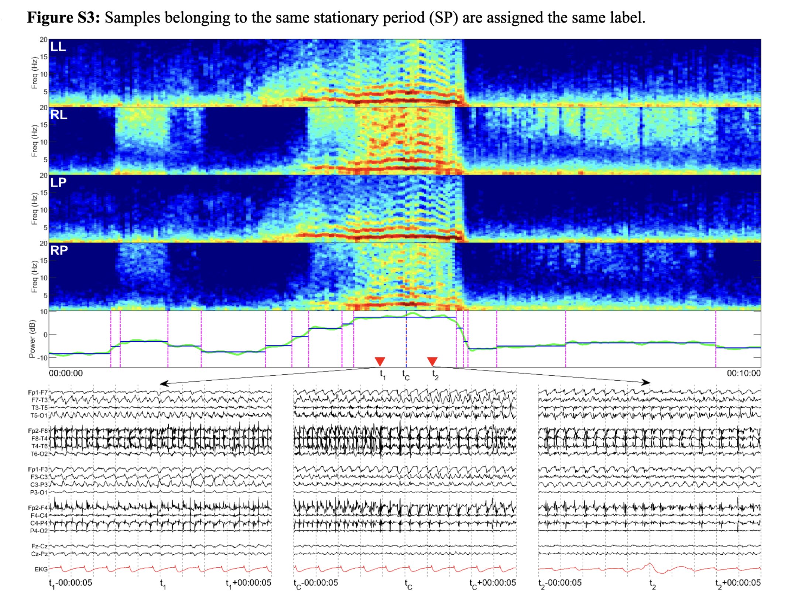

# コンペデータについて推察されること

## 概要

論文の付随資料[2]から得た知見。

* sohierの"roughly equivelent"[1]という発言から、SPaRCNetのデータとコンペデータは一部重複、あるいはほぼ同一である可能性がある。
* SPaRCNetのデータは、以下の4種類のラベルからなる
  1. high quality: 20人の専門家によって作成したラベル(n_votes>=10)
      - dataset3: train
      - dataset4: test (train, testのseiqure typeの分布はほぼ同じになるように調整している)
  2. low quality: n_votes>=3
      - dataset1 (111,095 segments): 非専門家によるラベルや、vote数が少なすぎるラベル
      - dataset2 (103,818 segments): dataset1のサブセットで、high qualityのみで学習したモデルでPseudo Labelを付加したもの
* 専門家がラベルづけしたセグメントを周辺のStational Period(定常期間; SP)にラベル拡張している。

## Stationary Period (SP)

*stationary period*とは、EEGのactivityで状態が不変な期間のこと。
EEGのPower(おそらくspecのpowerの周波数方向の平均値)が変化するポイントで検知したらしい。

> Empirically, the EEG can be divided into a series of “stationary periods” (SP), within which the pattern of EEG activity is unchanging. These SP can be identified by detecting changepoints within the EEG power, as illustrated in Figure S3.

「専門家がSPの中央にラベルをつけ、SP内の近隣にラベルを拡張した」という記述がある。

> In our approach, experts label the central EEG segment, and the same label is then automatically assigned to the remaining segments within the SP, increasing the number of labeled samples available for model training and evaluation.

## Pseudo Labelの生成方法

* 20人の専門家のそれぞれについて、high qualityデータで6クラス中どれにvoteするかのone hotベクトルを学習。それら20個のvote modelによるcount vectorを集計することで擬似的に「専門家よよる投票」を再現した。

## 上記から示唆されること

* 連続する同一ラベルの中央が最も正確なラベル -> train/validの精度向上に応用できる？
* low quality(n_vote<10)のラベルはhigh quality(n_vote>=10)とannotatorが異なるという仮説は間違いなさそう -> n_vote>=10によるCVが合理的？

## Reference

- [1] https://www.kaggle.com/competitions/hms-harmful-brain-activity-classification/discussion/471439#2627521
- [2] https://github.com/bdsp-core/IIIC-SPaRCNet/blob/main/IIIC_Classification-Supplemental.pdf